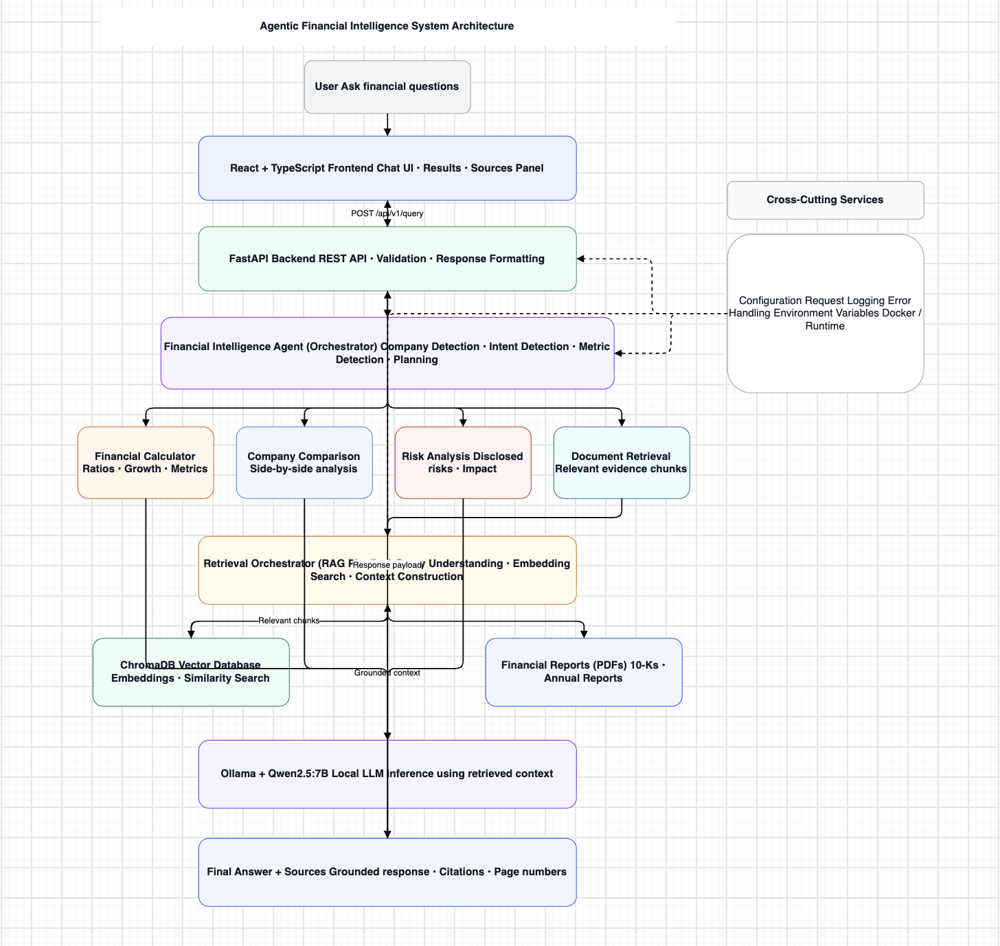
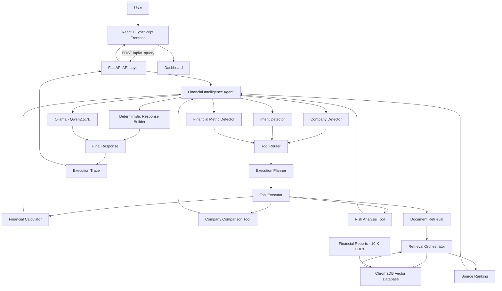
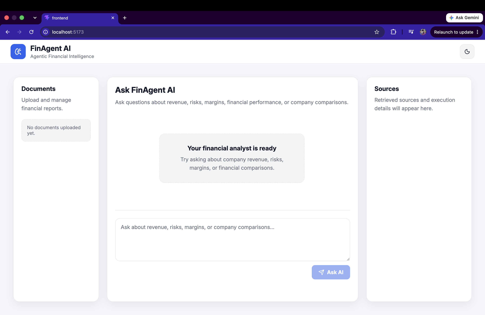
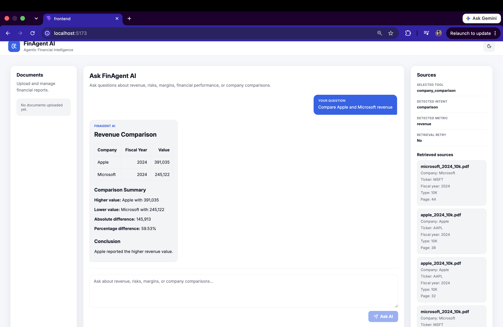
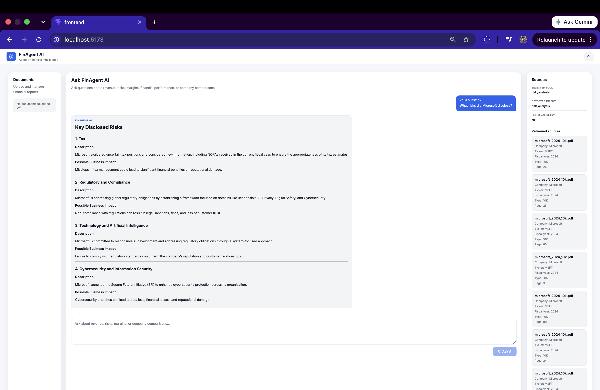
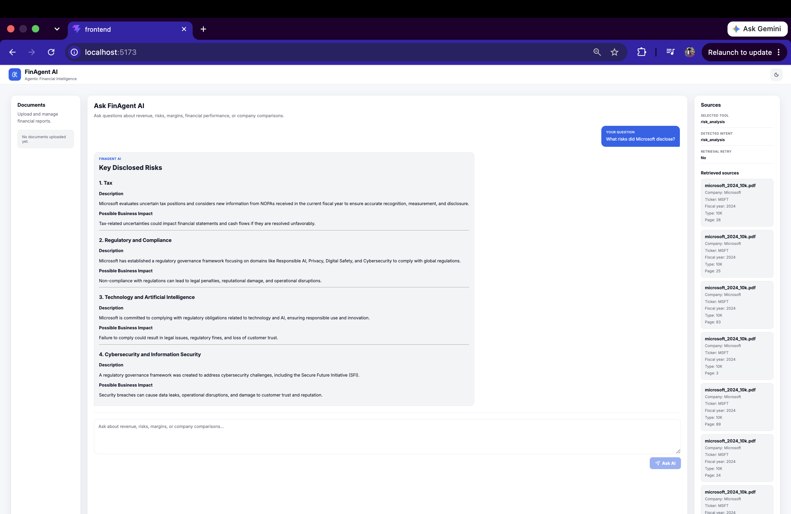

# 🚀 Agentic Financial Intelligence System


> An enterprise-grade AI-powered financial intelligence platform that combines Retrieval-Augmented Generation (RAG), intelligent tool routing, semantic document search, and local LLM inference to analyze financial reports and answer complex financial questions.

---

## ✨ Overview

The Agentic Financial Intelligence System enables users to interact with company financial reports using natural language.

Instead of relying on a single chatbot response, the system intelligently determines the user's intent, selects the appropriate financial analysis tool, retrieves supporting evidence from financial filings, and generates grounded answers with citations.

The application features a modern React dashboard, a FastAPI backend, ChromaDB vector search, and Ollama-powered local LLM inference.

---

# Features

- Financial report question answering
- Revenue comparison between companies
- Financial ratio calculations
- Risk analysis from SEC filings
- Semantic document retrieval
- Intelligent tool routing
- Retrieval-Augmented Generation (RAG)
- Conversation memory
- Source attribution
- Local LLM inference using Ollama
- Responsive React dashboard
- Docker support

---


# Architecture
📄 [View the editable Draw.io architecture](docs/architecture.drawio)





---

# Tech Stack
---


---


## Frontend

- React
- TypeScript
- Vite
- Axios
- CSS

## Backend

- FastAPI
- Python
- Pydantic
- Uvicorn

## AI & Retrieval

- Ollama
- Qwen2.5:7B
- ChromaDB
- Sentence Transformers

## DevOps

- Docker
- Docker Compose
- GitHub Actions

---

# Project Structure

```
backend/
│
├── agents/
├── api/
├── core/
├── data/
├── models/
├── schemas/
├── services/
├── tools/
└── main.py

frontend/
│
├── src/
│   ├── components/
│   ├── pages/
│   ├── services/
│   ├── hooks/
│   └── assets/

docker-compose.yml
README.md
requirements.txt
```

---

# Current Capabilities

- Compare company revenues
- Analyze financial risks
- Retrieve evidence from annual reports
- Explain business metrics
- Provide cited answers
- Display retrieved sources
- Show execution details
- Track selected tools

---

# Example Questions

```
Compare Apple and Microsoft revenue

What risks did Microsoft disclose?

What was Apple's operating income?

Compare NVIDIA and AMD revenue.

What cybersecurity risks are mentioned in Microsoft's report?
```

---

# Screenshots

> Screenshots will be added soon.

## Dashboard



---

## Revenue Comparison



---

## Risk Analysis




## Source Citations



---

## System Architecture


---

# Installation

Clone the repository

```bash
git clone https://github.com/gouthambilluri02/agentic-financial-intelligence-system.git
```

Install frontend

```bash
cd frontend
npm install
npm run dev
```

Run backend

```bash
docker compose up --build
```

Open

```
http://localhost:5173
```

---

# Future Enhancements

- Multi-agent collaboration
- SQL financial database integration
- PDF upload from UI
- Graph generation
- Financial trend visualization
- Streaming responses
- Authentication
- Cloud deployment (AWS/Azure)
- Portfolio analytics
- Earnings call analysis

---

# License

MIT License

---

## Author

**Goutham Billuri**

AI / ML Engineer

Specializing in Agentic AI, RAG Systems, LLM Applications, and Production AI Platforms.